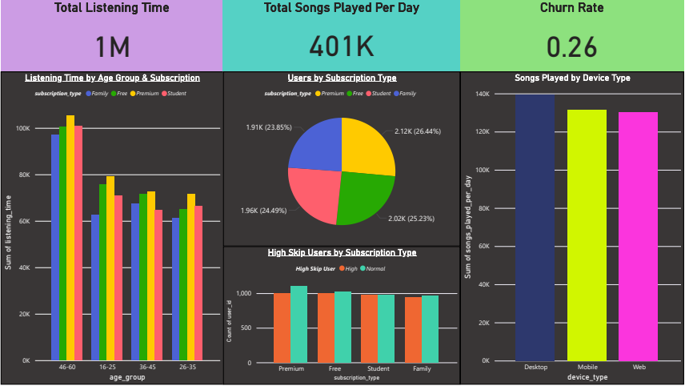
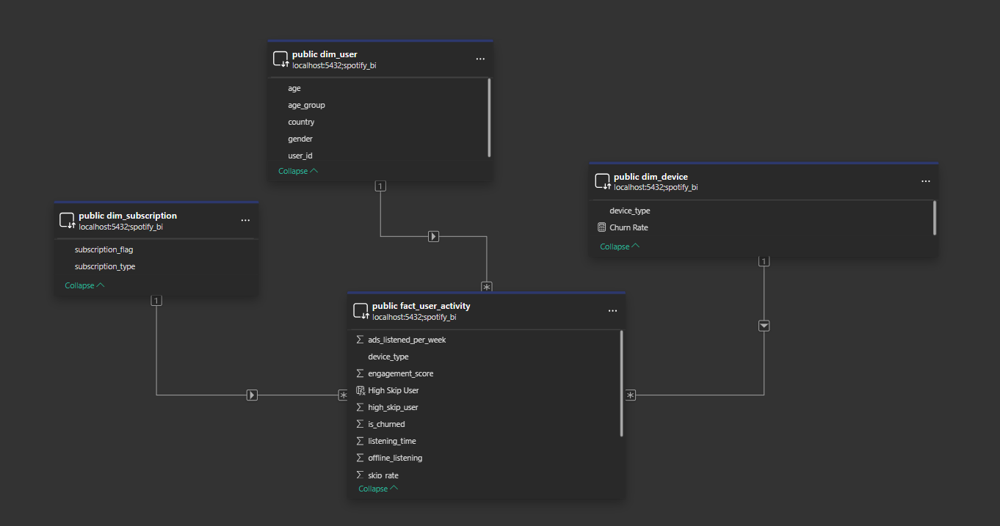

# 🎧 Spotify User Analytics Dashboard



## 🌟 Project Overview

This repository hosts a comprehensive **Power BI Dashboard** that provides deep, actionable insights into user behavior on a music streaming platform (simulated/inspired by Spotify).

The analysis focuses on key metrics such as **user engagement**, **listening habits**, **churn dynamics**, and **preferences** across various user segments. This project serves as a showcase of end-to-end **data analysis, modeling, and visualization** skills using industry-standard tools.

---

## ✨ Features & Analytical Breakdown

The dashboard is built upon a robust data model to deliver the following key analytical features and corresponding business value:

| Feature | Description | Business Value |
| :--- | :--- | :--- |
| **KPI Scorecard** | Real-time calculation of **Total Listening Time**, **Total Songs Played**, and **Churn Rate**. | Provides a quick, quantitative health check of the platform's performance. |
| **Engagement Profile** | Trend analysis of engagement (listening time, skip rate) segmented by **Age Group** and **Subscription Type**. | Identifies high-value segments and potential areas for product or content improvement. |
| **Churn Analysis** | Detailed breakdown of churn rate by **Subscription Tier**. | Pinpoints the tiers most susceptible to leaving, aiding targeted retention campaigns. |
| **Device & Geo Breakdown** | Visualization of user distribution and activity by **Device Type** and **Country**. | Informs marketing strategy and resource allocation (e.g., app optimization). |
| **Interactive Filters** | Dynamic filtering capabilities across Age, Country, Subscription, and Device Type. | Enables deep-dive investigation into any specific user segment's behavior. |

---

## 💡 Key Insights

The dashboard analysis validates several critical observations for potential business strategies:

* **Premium Advantage:** Users on the **Premium** subscription tier exhibit the highest overall engagement and lowest skip rates, confirming the robust value of the paid offering.
* **Generational Habits:** **Younger users (18–25)** are the highest content consumers (more listening time) but also show a notably higher song skip rate, indicating exploratory behavior.
* **Retention Focus:** The **Churn Rate** is significantly higher among **Free tier users**, highlighting a critical area for targeted conversion or win-back campaigns.

---

## 🛠️ Tools & Technologies

| Category | Tool / Technology | Purpose |
| :--- | :--- | :--- |
| **Visualization** | **Power BI Desktop** | The core platform for developing the interactive dashboard and reports. |
| **Data Modeling** | **DAX (Data Analysis Expressions)** | Used for creating complex, dynamic measures (e.g., Churn Rate calculation). |
| **Data Exploration** | **Python (Pandas, Matplotlib, Seaborn)** | Data cleaning, initial profiling, and exploratory visualization (see `scripts/`). |
| **Data Source** | **PostgreSQL / CSV** | Used for storing and accessing the raw user activity and dimension data. |
| **Version Control** | **GitHub** | Repository hosting, version control, and portfolio showcase. |

---

## 📊 Data Model (Entity Relationship Diagram - ERD)

The analysis is powered by a clean, star-schema-like data model that connects user activity facts with relevant dimensional attributes.



---

## 🗂 Repository Structure

The project is meticulously organized into logical directories for clarity and easy navigation:

```text
spotify-user-analytics/
├── README.md                           # Project documentation (this file)
├── Spotify_User_Analytics.pbix         # The main Power BI Desktop dashboard file
├── ERD.png                             # Image of the Data Model (Entity Relationship Diagram)
|
├── screenshots/                        # Dashboard preview images
│   └── dashboard_overview.png          # Main screenshot of the final dashboard
|
├── data/                               # Sample raw or cleaned datasets
│   └── spotify_users.csv               # Sample CSV used for analysis (optional)
|
├── scripts/                            # Data processing or exploration scripts
│   └── explore_data.py                 # Python script for initial data profiling and cleaning
|
└── db/                                 # Database related files
└── schema.sql                      # SQL file defining the database schema or table creation
```


## 🚀 How to Run the Dashboard

1.  **Prerequisites:** Ensure you have **Power BI Desktop** installed on your machine.
2.  **Open:** Download or clone this repository and open the file named **`Spotify_User_Analytics.pbix`**.
3.  **Explore:** The report will load instantly. Explore the KPI cards, trend analysis, and breakdown charts, and use the interactive slicers to drill down into specific user segments.

---

## 🤝 Contribution & Support

Feel free to **fork** this repository, raise issues, or suggest improvements to the analysis or DAX logic.

If you find this project useful for your own learning or portfolio, please consider giving it a **Star**! ⭐

---

## 📜 License

This project is **open-source** and distributed under the **MIT License**.
